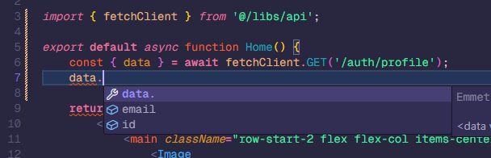
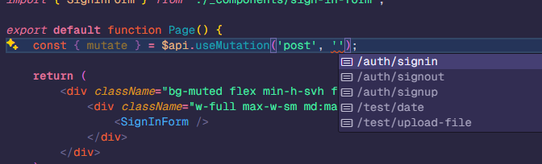

# 🚀 Next.js + Elysia Template

A powerful, feature-rich starter template for building modern web applications with Next.js and Elysia.

## ✨ Features

- **Next.js 15** with [app router](https://nextjs.org/docs/app)
  - **ShadCN UI**
  - Automatic type infer from api & database schema

    

  - Automatic useQuery & useMutation hooks generation

    

- **Elysia.js** for the backend
  - **Drizzle ORM**
  - **better-auth**
- Monorepo structure with **bun** as the package manager
  - Fully dockerized deployment

## 🛠️ Installation

Clone the repository and install dependencies:

```bash
# Clone the repository
git clone https://github.com/tonkaew131/nextjs-elysia-template.git
cd nextjs-elysia-template

# Install dependencies
bun i
```

Set up your environment variables:

```bash
cp .env.template .env
# Edit .env with your configuration
```

## 🔧 Development

Start development database:

```bash
docker-compose -f docker-compose.dev.yml up -d
```

Launch the development server:

```bash
bun dev
```

- [http://localhost:3000](http://localhost:3000) - Next.js frontend
- [http://localhost:3000/api/swagger](http://localhost:3000/api/swagger) - Elysia.js backend

Generate React Query hooks for API integration:

```bash
bun api:gen
```

## 📚 Other Commands

### Database Operations

Create a new migration:

```bash
bun db:gen --name "migration_name"
```

Apply pending migrations:

```bash
bun db:migrate
```

---

Happy coding! 🎉
